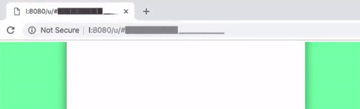
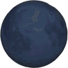
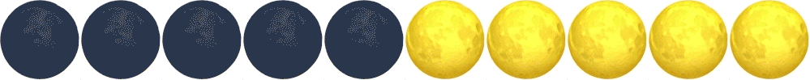

# Animating-Emojis-in-URLs
You can use emoji (and other graphical Unicode characters) in URLs. And wow is it great. But no one seems to do it. Why? Perhaps emoji are too exotic for normie web platforms to handle? Or maybe they are avoided for fear of angering the SEO gods?

# Demo - https://priyankvaghela.github.io/magic.html#%F0%9F%98%98
 


## 1. Animating Moon



```javascript
var f = ['🌑', '🌒', '🌓', '🌔', '🌝', '🌖', '🌗', '🌘'];

    function loop() {
        location.hash = f[Math.floor((Date.now()/100)%f.length)];

        setTimeout(loop, 50);
    }

    loop();
```

## 2. Rolling Clock
If you don't like the spinning moons you can swap out that array with whatever emojis you want. Like a clock:


```javascript
var f = ['🕐','🕑','🕒','🕓','🕔','🕕','🕖','🕗','🕘','🕙','🕚','🕛'];


    function loop() {
        location.hash = f[Math.floor((Date.now()/100)%f.length)];

        setTimeout(loop, 50);
    }

    loop();
```

## 3. Color-changing Babies    
This is a really simple example. Too simple really. So let's upgrade our loop so that it generates a string of multiple emoji! This time we're utilizing the emoji "skin tone modifiers" characters to make some color-changing babies:


```javascript
var e = ['🏻', '🏼', '🏽', '🏾', '🏿'];

    function loop() {
        var s = '',
            i, m;

        for (i = 0; i < 10; i ++) {
            m = Math.floor(e.length * ((Math.sin((Date.now()/100) + i)+1)/2));
            s += '👶' + e[m];
        }

        location.hash = s;

        setTimeout(loop, 50);
    }

    loop();
```

## 4. Rising Sun
We use a sine wave controlled by time and position to select which color we want. This gives us a nice loopy color changing effect!
Or how about we revisit our moon spinner, spread it out, and make something resembling a loading indicator? Sure, let's do it:



```javascript
var f = ['🌑', '🌘', '🌗', '🌖', '🌕', '🌔', '🌓', '🌒'],
        d = [0, 0, 0, 0, 0, 0, 0, 0, 0, 0],
        m = 0;

    function loop() {
        var s = '', x = 0;

        if (!m) {
            while (d[x] == 4) {
                x ++;
            }

            if (x >= d.length) m = 1;
            else {
                d[x] ++;
            }
        }
        else {
            while (d[x] == 0) {
                x ++;
            }

            if (x >= d.length) m = 0;
            else {
                d[x] ++;

                if (d[x] == 8) d[x] = 0;
            }
        }

        d.forEach(function (n) {
            s += f[n];
        });

        location.hash = s;

        setTimeout(loop, 50);
    }

    loop();
```

## 5. 2D Wave

Many of these lend themselves better to a two-dimensional output. But they're still
